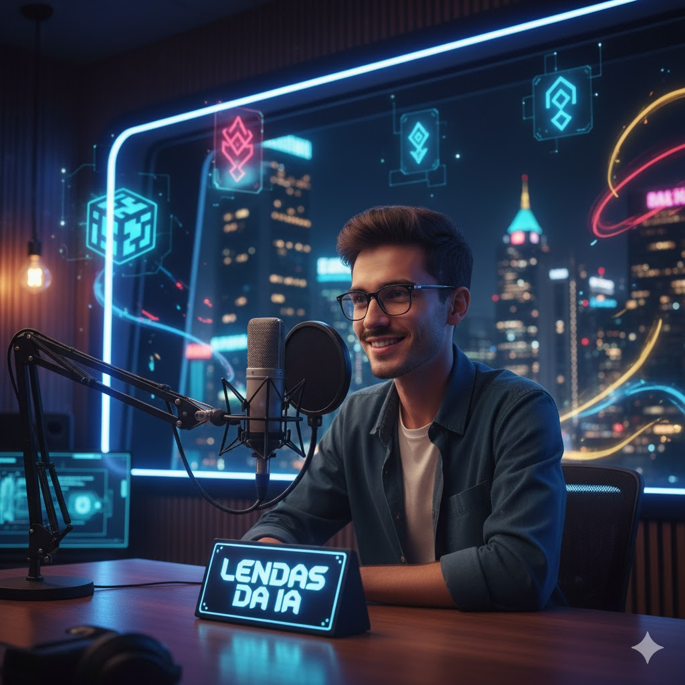

## Resultado Final

[SoundCloud](https://tinyurl.com/LendasdaIAep01)

## 💻 Tecnologias utilizadas no projeto

- [ChatGPT](https://chat.openai.com/) 
- [Suno-IA](https://suno.com/)
- [Gemini](https://gemini.google.com/)
- [ElevenLabs](https://beta.elevenlabs.io/)
- [Capcut](https://www.capcut.com/pt-br/)
- [Leonardo IA](https://leonardo.ai/)

## ✨ Como foi feito ?

- Roteiro gerado via chatgpt/Gemini
- Audio gerado pela elevenLabs
- Leonardo IA para gerar capas
- Suno IA para gerar vinheta musical
- Capcut para tratar aúdio e adicionar sons de fundo
